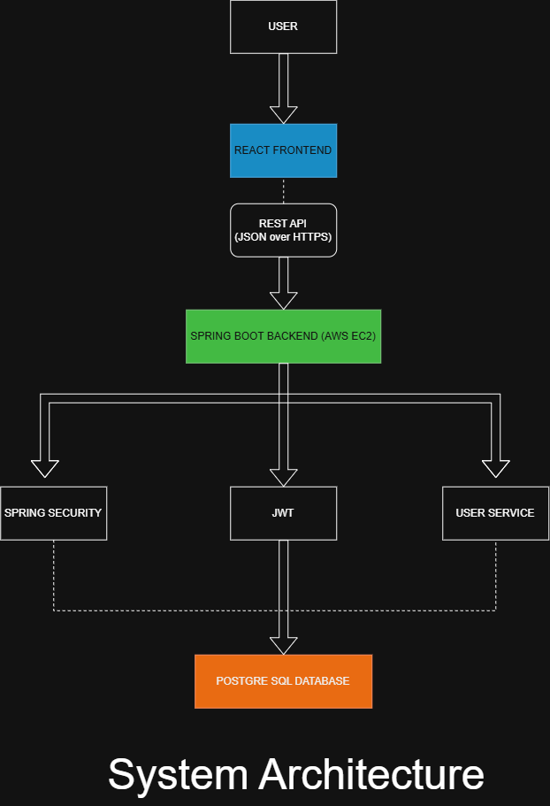

# CYPHER

> **AI-Powered Smart Monitoring & User Management Platform**


---

> **AI-Powered Smart Monitoring & User Management Platform**

---

## 📌 Project Overview

CYPHER is an AI-powered platform designed to provide secure user authentication, intelligent monitoring, and centralized management through a modern web application.

The platform combines secure backend services, cloud deployment, and a scalable architecture to create a strong foundation for future AI-powered features such as anomaly detection, user behavior analytics, and intelligent security recommendations.

---

## ❓ Problem Statement

Organizations often rely on fragmented systems for authentication and monitoring, making administration difficult and increasing security risks.

CYPHER provides a centralized, secure, and scalable platform that simplifies user management while preparing the system for future AI-driven analytics.

---

## 🎯 Vision Statement

To build an intelligent, secure, and scalable platform that combines modern authentication, cloud-native architecture, and AI capabilities to improve security, usability, and system management.

---

## 👥 Target Users

- Small and Medium Businesses
- Educational Institutions
- Startup Companies
- System Administrators
- IT Teams

---

## 🚀 Features

### ✅ Current Features

- User Registration
- Secure Login
- BCrypt Password Encryption
- JWT Authentication
- PostgreSQL Database
- REST APIs
- Cloud Deployment (AWS EC2)
- Secure Protected Routes

### 🤖 Planned AI Features

- AI-powered Login Anomaly Detection
- Intelligent Activity Monitoring
- Suspicious Login Alerts
- User Behaviour Analytics
- Smart Dashboard Insights
- Predictive Security Recommendations

---

## 🛠 Tech Stack

### Backend

- Spring Boot
- Spring Security
- Java 21
- Maven
- JWT

### Database

- PostgreSQL

### Frontend

- React
- TypeScript

### Cloud

- AWS EC2
- Ubuntu Linux

### Tools

- Git
- GitHub
- Docker
- Postman
- Figma
- Draw.io

---
---

## 🏗️ System Architecture

The CYPHER platform follows a three-tier architecture consisting of a React frontend, a Spring Boot backend, and a PostgreSQL database. Authentication is secured using JWT and Spring Security, while the backend is deployed on AWS EC2.



---

## 📈 Success Metrics

- Secure JWT Authentication
- BCrypt Password Hashing
- RESTful API Architecture
- Cloud Deployment
- Modular Backend Design
- AI-ready Architecture
- Fast Authentication Response

---

## 📂 Project Structure

```
CYPHER/
│
├── backend/
│   ├── controller/
│   ├── service/
│   ├── repository/
│   ├── entity/
│   ├── dto/
│   ├── security/
│   └── config/
│
├── frontend/
│
├── docs/
│
└── README.md
```
---## 🔀 Branching Strategy (GitHub Flow)

CYPHER follows the **GitHub Flow** branching strategy.

### Workflow

1. The `main` branch always contains stable and production-ready code.
2. A new **feature branch** is created for every new feature or enhancement.
3. Development is carried out on the feature branch.
4. Changes are committed regularly with meaningful commit messages.
5. The feature branch is pushed to GitHub.
6. A Pull Request (PR) is created to review the changes.
7. After review, the Pull Request is merged into the `main` branch.

### Branch Structure

- `main` → Stable production-ready branch
- `feature/docker-support` → Docker integration
- Future feature branches:
  - `feature/frontend-ui`
  - `feature/ai-module`
  - `feature/user-management`

This workflow helps maintain code quality, supports collaboration, and keeps the `main` branch stable.

## ⚙️ Getting Started

### Clone Repository

```bash
git clone git@github.com:adithyansnair-codes/Cypher-project.git
```

### Backend

```bash
cd backend
./mvnw spring-boot:run
```

Backend runs on

```
http://localhost:8081
```

---
---

# 🚀 Quick Start – Local Development

Follow these steps to run the CYPHER project locally.

## Prerequisites

Make sure the following software is installed:

- Java 21
- Maven
- PostgreSQL
- Git
- Node.js (for the frontend)
- Docker (optional)

---

## Clone the Repository

```bash
git clone git@github.com:adithyansnair-codes/Cypher-project.git
cd Cypher-project
```

---

## Backend Setup

Navigate to the backend folder:

```bash
cd backend
```

Run the application:

```bash
./mvnw spring-boot:run
```

The backend will start on:

```
http://localhost:8081
```

---

## Database Setup

Create a PostgreSQL database named:

```
cypher
```

Update your `application.properties` if needed:

```properties
spring.datasource.url=jdbc:postgresql://localhost:5432/cypher
spring.datasource.username=postgres
spring.datasource.password=your_password
```

---

## Frontend Setup

Navigate to the frontend folder:

```bash
cd frontend
npm install
npm start
```

The frontend will run on:

```
http://localhost:3000
```

---

## API Testing

Use Postman or cURL to test the APIs.

Example:

```bash
curl -X POST http://localhost:8081/auth/login \
-H "Content-Type: application/json" \
-d '{"email":"virat@example.com","password":"virat123"}'
```

---

## Project Structure

```
CYPHER
├── backend
├── frontend
├── docs
├── database
├── Dockerfile
├── docker-compose.yml
└── README.md
```

---

## 👨‍💻 Team Members

| Name | Responsibility |
|------|----------------|
| Harsh Singh | Backend Development & Authentication |
| Satyanarayanan Sai | Frontend Development & Integration |
| Adityan S. Nair | Database Design & Cloud Deployment |

---

## 📜 License

This project was developed for academic purposes at **VIT Chennai**.
