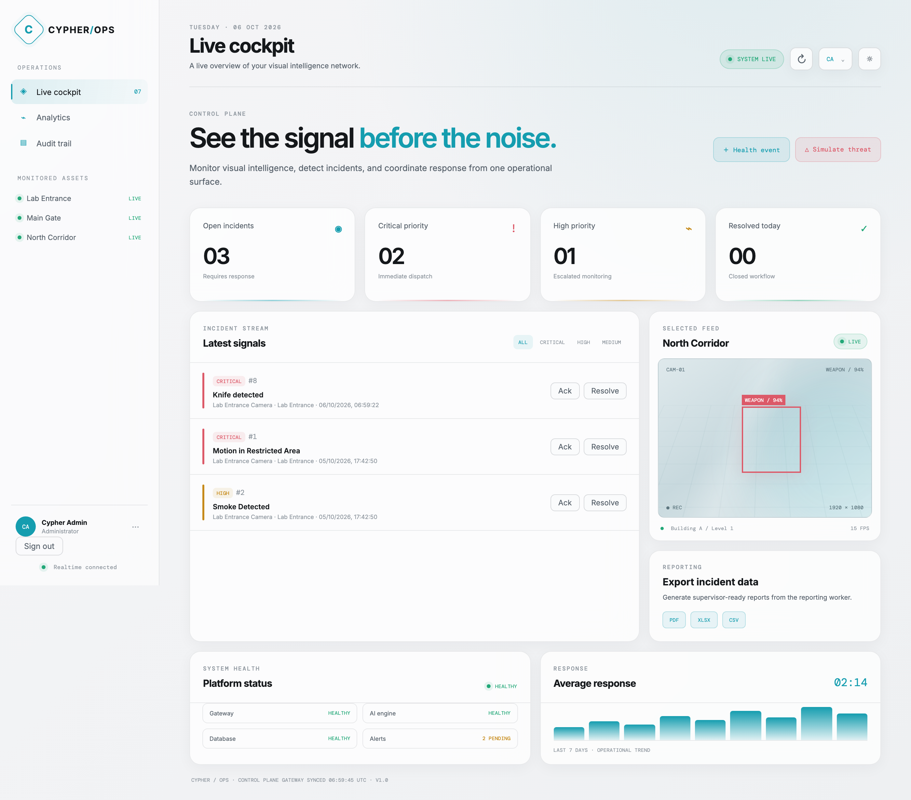

# ai — CYPHER AI engine

Computer-vision incident detection. Runs YOLO, reports findings to the Spring
Boot gateway, which owns the database. This service holds no persistent state.

## Verified result

A fine-tuned weapon detector driving the live incident pipeline:

```
image  ->  YOLO  ->  POST /api/incidents/ingest  ->  CRITICAL incident in the cockpit
```



## Model

| | |
|---|---|
| Architecture | YOLOv8n (transfer learning from COCO weights) |
| Dataset | guns-knives object detection — 4,409 train / 1,043 val / 385 test |
| Classes | `knife`, `pistol` |
| Input | 416 px |
| Training | 8 epochs, Apple MPS, **5 minutes** |

**Validation metrics** (1,043 images, 1,203 instances):

| Metric | Value |
|---|---|
| mAP@50 | **0.589** |
| mAP@50-95 | **0.403** |
| Mean precision | 0.751 |
| Mean recall | 0.509 |

| Class | Precision | Recall | AP@50 |
|---|---|---|---|
| knife | 0.806 | 0.345 | 0.452 |
| pistol | 0.697 | 0.673 | 0.725 |

Full numbers in [`evidence/metrics.json`](evidence/metrics.json), curves and
confusion matrix in [`evidence/`](evidence/).

**Honest limitations.** 8 epochs on ~27% of the training set, chosen to fit a
short deadline; both loss curves were still falling when training stopped, so
more epochs would improve these numbers. Knife recall (0.345) is the weak point
— knives are small, low-contrast and often partly occluded. This is a working
prototype, not a production detector.

## Endpoints

| Method | Path | Purpose |
|---|---|---|
| GET | `/health` | liveness, loaded weights, gateway reachability |
| POST | `/detect` | run detection on an uploaded image, **no side effects** |
| POST | `/monitor/frame` | detect **and raise incidents** for what it finds |
| POST | `/monitor/stream` | bounded run over a video file or camera index |

## Run

```bash
python -m venv .venv && . .venv/bin/activate
pip install -r requirements.txt
uvicorn ai.app.main:app --host 0.0.0.0 --port 5000
```

Configuration is entirely environment-driven — `GATEWAY_URL`, `YOLO_WEIGHTS`,
`YOLO_CONFIDENCE`, `CYPHER_CAMERA_ID`, `INCIDENT_COOLDOWN`. See `app/config.py`.

## Design notes

**Severity is decided by the gateway, not here.** This service reports *what* it
saw; `IncidentService.deriveSeverity` decides that a weapon is CRITICAL
regardless of confidence. A new detector therefore cannot invent its own
priority vocabulary.

**One incident per object class per frame.** A single image often yields several
overlapping boxes for the same object; reporting each one raised five identical
incidents from one photograph. The best-confidence detection per class wins.

**Cooldown.** A 30 fps stream would otherwise raise 30 incidents a second. The
same class on the same camera is suppressed for `INCIDENT_COOLDOWN` seconds.

## Training

Training scripts live outside the repo (they need the Kaggle dataset). The
pipeline was:

1. `train.py` — fine-tune `yolov8n.pt` on the guns-knives YOLO dataset
2. `evaluate.py` — validation metrics, confusion matrix, PR curves, labelled samples

To reproduce, point `data.yaml` at your copy of the dataset — the Kaggle version
hardcodes `/kaggle/input/...` paths and fails anywhere else.

## Next

- Microphone-free fall detection and fire/smoke (needs a labelled dataset; the
  "Datacluster Fire and Smoke **Sample**" set is only 100 images and cannot train)
- Swap the Mac webcam for the ESP32-CAM stream. The detector takes any
  `cv2.VideoCapture` source, so only `source` changes.
